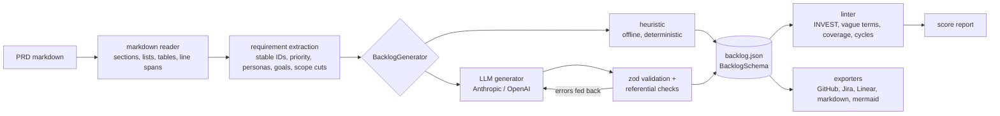

# prd-to-backlog


Turning a PRD into tickets is slow, and it loses things. Requirements get merged or dropped,
acceptance criteria get paraphrased into something nobody can test, and a month later nobody can
say which ticket a PRD line became. `prd2backlog` parses a markdown PRD into requirements with
stable IDs and source line numbers. It then generates epics, user stories, Given/When/Then
acceptance criteria, estimates, dependencies and risks, all validated against a zod schema. A
linter scores the result for INVEST, vague wording, testability, traceability coverage and
dependency cycles. Exporters write GitHub Issues payloads, Jira CSV, Linear CSV, markdown and a
mermaid dependency graph. The default generator is deterministic and runs offline. Anthropic
and OpenAI adapters are optional.

## Quickstart

Requires Node 20 or later.

```sh
npm ci
npm run build
node dist/bin.js generate examples/team-invites.md --out out/
node dist/bin.js lint out/backlog.json
node dist/bin.js export out/backlog.json --format jira --out out/jira.csv
```

After `npm link` (or a global install) the same commands are available as `prd2backlog`.

| Command                                                         | What it does                                                       |
| --------------------------------------------------------------- | ------------------------------------------------------------------ |
| `prd2backlog generate <prd.md> [--out dir] [--provider p]`      | Writes `backlog.json` and a reviewable `backlog.md`                |
| `prd2backlog lint <backlog.json> [--format json] [--min-score]` | Scored report; `--min-score` exits 1 below the threshold (CI gate) |
| `prd2backlog export <backlog.json> --format <f> [--out file]`   | `github`, `jira`, `linear`, `markdown`, `mermaid`                  |
| `prd2backlog serve [--port 8787]`                               | HTTP API: `POST /generate`, `POST /lint`, `POST /export`           |

Development: `npm run lint`, `npm run format:check`, `npm run typecheck`, `npm test`,
`npm run eval`, `npm run demo` (regenerates `examples/output/`). To use an LLM, set
`ANTHROPIC_API_KEY` or `OPENAI_API_KEY` (see `.env.example`) and pass
`--provider anthropic|openai`. The Docker image runs the CLI:
`docker build -t prd2backlog . && docker run --rm prd2backlog generate examples/team-invites.md`.

## Example output

The following is real output from the commands above, run on the bundled synthetic team-invites PRD:

```text
$ prd2backlog generate examples/team-invites.md --out out/
Parsed 12 requirements from examples/team-invites.md (3 out-of-scope items)
Generated 4 epics, 12 stories (23 pts), 8 dependencies, 3 risks with heuristic
Lint score 97/100 (A), traceability 100%, 0 errors, 7 warnings
Wrote out/backlog.json and out/backlog.md

$ prd2backlog lint out/backlog.json
Score: 97/100 (A)
Story quality: 94.2/100
Traceability: 12/12 requirements covered (100%)
Dependency cycles: 0
Findings: 0 errors, 7 warnings, 12 info

warning AC-b7f7fa-1    untestable-criterion         Then-clause uses subjective terms (fast, easy): "the invite flow should be fast and easy for invitees". State a measurable or visible result.
warning ST-03f995      inferred-criterion           All criteria were inferred; the PRD gives no testable detail for this story.
warning ST-51ea02      inferred-criterion           All criteria were inferred; the PRD gives no testable detail for this story.
warning ST-9b69c7      inferred-criterion           All criteria were inferred; the PRD gives no testable detail for this story.
warning ST-b7f7fa      inferred-criterion           All criteria were inferred; the PRD gives no testable detail for this story.
warning ST-b7f7fa      vague-language               Vague wording: "fast", "easy". Replace with a measurable target.
warning ST-c74591      inferred-criterion           All criteria were inferred; the PRD gives no testable detail for this story.
```

The warnings point at the PRD, not at the generator. The PRD says "The invite flow should be
fast and easy", which no one can test. Five requirements have no detail bullets, so their
acceptance criteria had to be inferred. Here is one story from `out/backlog.md`:

```markdown
### ST-456a6d: Invite teammates by entering one or more email addresses

As a workspace admin, I want to invite teammates by entering one or more email addresses, so that it supports the goal "Let workspace owners add their team without contacting support".

- Priority: should | Estimate: 5 pts
- Estimate rationale: base 1; +2 for 3 acceptance criteria; +1 measurable performance target (within 2 minutes) = score 4 -> 5 pts
- Traces to REQ-456a6d (examples/team-invites.md:27): Workspace admins can invite teammates by entering one or more email addresses.
- Labels: benefit-inferred

Acceptance criteria:

- [ ] **Given** a workspace admin, **when** an admin submits up to 20 valid addresses, **then** each address receives an invite email within 2 minutes.
- [ ] **Given** a workspace admin, **when** an address is malformed, **then** the form shows an inline error and no invite is sent for it.
- [ ] **Given** a workspace admin, **when** the address already belongs to a member, **then** the admin sees "already a member".
```

`npm run eval` on the bundled synthetic corpus (no API keys set, so only the heuristic
generator ran):

```text
| PRD | Generator | Extraction recall | Capability coverage | Traceability | Lint score | Schema valid | Stories |
| --- | --- | ---: | ---: | ---: | ---: | --- | ---: |
| examples/mobile-offline-mode.md | heuristic | 100% | 92% | 100% | 94 | yes | 10 |
| examples/team-invites.md | heuristic | 100% | 100% | 100% | 97 | yes | 12 |
| examples/usage-based-billing.md | heuristic | 100% | 100% | 100% | 96 | yes | 11 |

- examples/mobile-offline-mode.md / heuristic: missed Cache retention policy
```

The one miss is expected. Cache retention appears in the offline PRD only as an open question,
so it becomes a risk rather than a story. Every output file, including tracker exports, is
committed under [`examples/output/`](examples/output/). A test fails if those samples drift
from what the code produces.

## Architecture



| Module                        | Responsibility                                                                    |
| ----------------------------- | --------------------------------------------------------------------------------- |
| `src/prd/markdown.ts`         | Block-level markdown reader that keeps 1-based line spans for every block         |
| `src/prd/extract.ts`          | Section roles, requirement extraction, content-addressed IDs, acceptance notes    |
| `src/model/schema.ts`         | zod schemas for the backlog plus referential checks (unique IDs, resolvable refs) |
| `src/generate/heuristic/`     | Story phrasing, criteria, signal-based estimates, dependency and risk inference   |
| `src/generate/llm/`           | Provider-agnostic generator, prompt, repair loop, Anthropic and OpenAI clients    |
| `src/lint/`                   | Rules, scoring, iterative Tarjan SCC for cycles                                   |
| `src/export/`                 | Tracker formats and the mermaid graph                                             |
| `src/eval/`, `eval/`          | Coverage scoring against hand-written expectations                                |
| `src/cli.ts`, `src/server.ts` | commander CLI and Hono API over the same pipeline                                 |

## Design decisions

- **Requirements are parser-owned.** Models generate epics, stories, dependencies and risks
  only. The requirement list, its IDs and its line numbers always come from the parser, so a
  model cannot invent or reword scope, and every story citation can be checked.
- **Content-addressed IDs.** A requirement without an explicit PRD ID (`FR-3`) gets
  `REQ-<sha1 of normalised text>`. Inserting, deleting or reordering other requirements does
  not renumber it, so references in trackers stay valid across PRD revisions. Editing the
  requirement's own wording changes its ID, and that is intended: it is a different requirement.
- **A heuristic default that does real work.** It reads the PRD structure, not keywords. Detail
  bullets become Given/When/Then criteria, headings become epics, "Must have" buckets set
  priority, and "Depends on FR-2" becomes an explicit edge. Create/consume verb pairs ("invite"
  then "revoke an invite") become inferred edges. Same input, byte-identical output, which is
  what makes snapshot tests and the committed samples possible.
- **Inference is labelled, never hidden.** Criteria carry `origin: prd | inferred`. Benefits
  linked to a PRD goal carry a `benefit-inferred` label. Inferred dependencies are dotted in the
  graph. Estimates list every signal that moved the number. The linter turns these labels into
  review prompts instead of treating generated text as fact.
- **Repair loop over trust.** LLM output goes through JSON extraction, zod validation and
  referential checks. Unknown requirement IDs, dangling dependencies and uncited stories are
  sent back to the model verbatim, for up to three attempts, after which it fails loudly.
- **A score you can argue with.** Each story starts at 100 and loses 25 per error and 10 per
  warning. The backlog score is 60% mean story quality plus 40% traceability coverage, minus
  10 per dependency cycle. Info findings cost nothing; they mark things a person should look at.
- **Own markdown reader instead of remark.** PRDs use a small, predictable subset of markdown.
  A reader of under 300 lines with exact line spans, setext headings, nested lists, tables and front
  matter was simpler to make line-accurate than mapping mdast positions back through
  list nesting. It is covered by its own tests.

## Data

All PRDs in `examples/` are **synthetic**. I wrote them for this repo and each one says so in
its header: team invites, usage-based billing, and offline mode for a field-inspections mobile
app. They do not describe a real product, company or customer. The eval expectations in
`eval/expected/` are also hand-written and synthetic. No external datasets are used or
downloaded.

## Limitations

- The heuristic generator writes one story per requirement. It does not split a large
  requirement or merge small ones. That is a refinement call for a person or an LLM.
- Story phrasing is pattern-based ("X can Y", "The system must Y", "As a X, I want Y"). Unusual
  sentence shapes fall back to a literal "I want ..." clause, and the linter usually flags them.
- Inferred dependencies come from verb/noun overlap. They catch "create before act on" chains
  and miss semantic ones (for example, offline storage before background sync).
- Estimates are relative signals, not velocity-calibrated forecasts.
- The lint score grades structure and wording, not whether the product decisions are right. On
  the bundled corpus it is also grading the heuristic's own output. It is most useful for
  comparing generators, or a backlog before and after review.
- The LLM adapters are covered by tests against faked HTTP responses. They have not been
  benchmarked against live models in this repo, so the eval table above has heuristic rows only.
- Jira and Linear CSV column names follow their importers' documented fields. Confirm the
  column mapping in the importer UI on first use.

## Roadmap

See [docs/PRODUCT.md](docs/PRODUCT.md) for the problem framing, success metrics and the
now / next / later roadmap. Two-way sync with trackers is the main item under "later".

## License

MIT, copyright 2026 Sean McRae. See [LICENSE](LICENSE).
