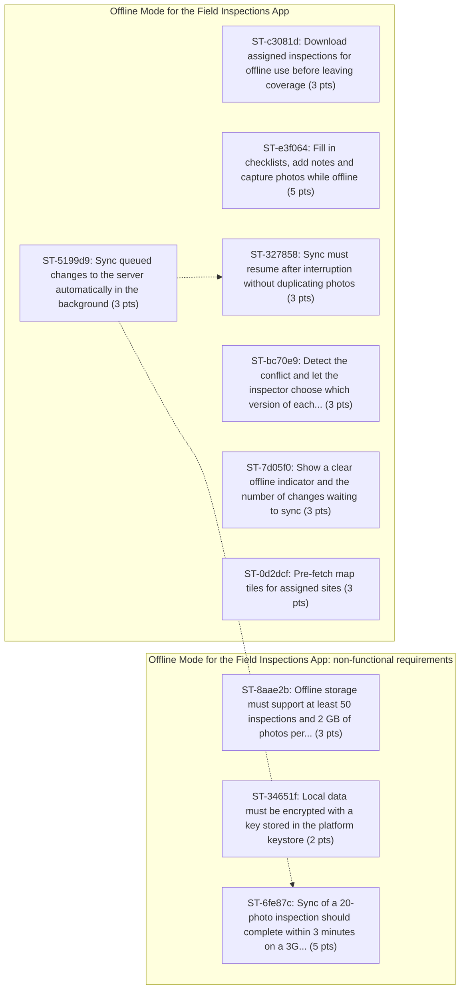

# Backlog: Offline Mode for the Field Inspections App

Generated by `heuristic` from `examples/mobile-offline-mode.md`.

| Epics | Stories | Story points | Requirements | Dependencies | Risks |
| ---: | ---: | ---: | ---: | ---: | ---: |
| 2 | 10 | 33 | 10 | 2 | 4 |

## EP-5715ce: Offline Mode for the Field Inspections App

Field inspectors use the mobile app at construction sites and rural facilities where signal is unreliable. When the connection drops, the app shows a spinner and inspectors lose notes and photos. Inspectors fall back to paper and re-type reports later.

### ST-c3081d: Download assigned inspections for offline use before leaving coverage

As a field inspector, I want to download assigned inspections for offline use before leaving coverage, so that it supports the goal "Inspectors can complete a full inspection with no connectivity".

- Priority: must | Estimate: 3 pts
- Estimate rationale: base 1; +2 distributed-state complexity (offline) = score 3 -> 3 pts
- Traces to REQ-c3081d (examples/mobile-offline-mode.md:27): Inspectors must be able to download assigned inspections for offline use before leaving coverage.
- Labels: benefit-inferred

Acceptance criteria:

- [ ] **Given** a field inspector, **when** the field inspector downloads assigned inspections for offline use before leaving coverage, **then** the download includes checklists, prior findings and site documents.

### ST-e3f064: Fill in checklists, add notes and capture photos while offline

As a field inspector, I want to fill in checklists, add notes and capture photos while offline, so that it supports the goal "Inspectors can complete a full inspection with no connectivity".

- Priority: must | Estimate: 5 pts
- Estimate rationale: base 1; +2 distributed-state complexity (offline); +1 security or compliance (encrypted) = score 4 -> 5 pts
- Traces to REQ-e3f064 (examples/mobile-offline-mode.md:30): The app must let inspectors fill in checklists, add notes and capture photos while offline.
- Labels: benefit-inferred

Acceptance criteria:

- [ ] **Given** a field inspector, **when** the field inspector fills in checklists, add notes and capture photos while offline, **then** all offline changes are stored locally and encrypted at rest.

### ST-5199d9: Sync queued changes to the server automatically in the background

As a field inspector, I want the system to sync queued changes to the server automatically in the background, so that it supports the goal "Inspectors can complete a full inspection with no connectivity".

- Priority: must | Estimate: 3 pts
- Estimate rationale: base 1; +2 distributed-state complexity (sync, queued, background) = score 3 -> 3 pts
- Traces to REQ-5199d9 (examples/mobile-offline-mode.md:33): When connectivity returns, the app must sync queued changes to the server automatically in the background.
- Labels: benefit-inferred

Acceptance criteria:

- [ ] **Given** a field inspector, **when** connectivity returns, **then** the app must sync queued changes to the server automatically in the background. _(inferred)_

### ST-327858: Sync must resume after interruption without duplicating photos

As a field inspector, I want sync to resume after interruption without duplicating photos, so that it supports the goal "Inspectors can complete a full inspection with no connectivity".

- Priority: must | Estimate: 3 pts
- Estimate rationale: base 1; +2 distributed-state complexity (sync, resume) = score 3 -> 3 pts
- Traces to REQ-327858 (examples/mobile-offline-mode.md:33): Sync must resume after interruption without duplicating photos.
- Blocked by: ST-5199d9
- Labels: benefit-inferred

Acceptance criteria:

- [ ] **Given** a field inspector, **when** the behaviour is exercised, **then** sync must resume after interruption without duplicating photos. _(inferred)_

### ST-bc70e9: Detect the conflict and let the inspector choose which version of each...

As a field inspector, I want the system to detect the conflict and let the inspector choose which version of each conflicting field to keep, so that it supports the goal "Inspectors can complete a full inspection with no connectivity".

- Priority: must | Estimate: 3 pts
- Estimate rationale: base 1; +2 distributed-state complexity (offline, conflict, conflicting) = score 3 -> 3 pts
- Traces to REQ-bc70e9 (examples/mobile-offline-mode.md:36): If the same inspection was edited on the server while the inspector was offline, the app must detect the conflict and let the inspector choose which version of each conflicting field to keep.
- Labels: benefit-inferred

Acceptance criteria:

- [ ] **Given** a field inspector, **when** the same inspection was edited on the server while the inspector was offline, **then** the app must detect the conflict and let the inspector choose which version of each conflicting field to keep. _(inferred)_

### ST-7d05f0: Show a clear offline indicator and the number of changes waiting to sync

As a field inspector, I want the system to show a clear offline indicator and the number of changes waiting to sync, so that it supports the goal "Inspectors can complete a full inspection with no connectivity".

- Priority: must | Estimate: 3 pts
- Estimate rationale: base 1; +2 distributed-state complexity (offline, sync) = score 3 -> 3 pts
- Traces to REQ-7d05f0 (examples/mobile-offline-mode.md:39): The app should show a clear offline indicator and the number of changes waiting to sync.
- Labels: benefit-inferred

Acceptance criteria:

- [ ] **Given** a field inspector, **when** the system shows a clear offline indicator and the number of changes waiting to sync, **then** the app should show a clear offline indicator and the number of changes waiting to sync. _(inferred)_

### ST-0d2dcf: Pre-fetch map tiles for assigned sites

As a field inspector, I want to pre-fetch map tiles for assigned sites, so that directions work offline.

- Priority: could | Estimate: 3 pts
- Estimate rationale: base 1; +2 distributed-state complexity (offline) = score 3 -> 3 pts
- Traces to REQ-0d2dcf (examples/mobile-offline-mode.md:43): Inspectors could pre-fetch map tiles for assigned sites so directions work offline.

Acceptance criteria:

- [ ] **Given** a field inspector, **when** the field inspector pre-fetches map tiles for assigned sites, **then** inspectors could pre-fetch map tiles for assigned sites so directions work offline. _(inferred)_

## EP-bfd533: Offline Mode for the Field Inspections App: non-functional requirements

Requirements under "Offline Mode for the Field Inspections App > Non-functional requirements".

### ST-8aae2b: Offline storage must support at least 50 inspections and 2 GB of photos per...

As a field inspector, I want offline storage to support at least 50 inspections and 2 GB of photos per device, so that it supports the goal "Inspectors can complete a full inspection with no connectivity".

- Priority: must | Estimate: 3 pts
- Estimate rationale: base 1; +2 distributed-state complexity (offline) = score 3 -> 3 pts
- Traces to REQ-8aae2b (examples/mobile-offline-mode.md:47): Offline storage must support at least 50 inspections and 2 GB of photos per device.
- Labels: non-functional, benefit-inferred

Acceptance criteria:

- [ ] **Given** a field inspector, **when** the behaviour is exercised, **then** offline storage must support at least 50 inspections and 2 GB of photos per device. _(inferred)_

### ST-34651f: Local data must be encrypted with a key stored in the platform keystore

As a field inspector, I want local data to be encrypted with a key stored in the platform keystore, so that it supports the goal "No inspection data is lost because of connectivity".

- Priority: must | Estimate: 2 pts
- Estimate rationale: base 1; +1 security or compliance (encrypted, keystore) = score 2 -> 2 pts
- Traces to REQ-34651f (examples/mobile-offline-mode.md:48): Local data must be encrypted with a key stored in the platform keystore.
- Labels: non-functional, benefit-inferred

Acceptance criteria:

- [ ] **Given** a field inspector, **when** the behaviour is exercised, **then** local data must be encrypted with a key stored in the platform keystore. _(inferred)_

### ST-6fe87c: Sync of a 20-photo inspection should complete within 3 minutes on a 3G...

As a field inspector, I want sync of a 20-photo inspection to complete within 3 minutes on a 3G connection, so that it supports the goal "Inspectors can complete a full inspection with no connectivity".

- Priority: should | Estimate: 5 pts
- Estimate rationale: base 1; +2 distributed-state complexity (sync); +1 measurable performance target (within 3 minutes) = score 4 -> 5 pts
- Traces to REQ-6fe87c (examples/mobile-offline-mode.md:49): Sync of a 20-photo inspection should complete within 3 minutes on a 3G connection.
- Blocked by: ST-5199d9
- Labels: non-functional, benefit-inferred

Acceptance criteria:

- [ ] **Given** a field inspector, **when** the behaviour is exercised, **then** sync of a 20-photo inspection should complete within 3 minutes on a 3G connection. _(inferred)_

## Dependencies

Solid arrows are stated in the PRD; dotted arrows were inferred.

## Risks

| ID | Risk | Likelihood | Impact | Mitigation | Related |
| --- | --- | --- | --- | --- | --- |
| RISK-af9cfd | Conflict resolution UX may confuse inspectors and lead to the wrong version being kept. | medium | medium | Not stated in PRD | ST-bc70e9 |
| RISK-62f445 | Low-end Android devices may run out of storage with large photo sets. | medium | medium | Not stated in PRD | ST-8aae2b |
| RISK-8d44b1 | Background sync is restricted by iOS and Android battery policies. | medium | medium | Not stated in PRD | ST-5199d9 |
| RISK-bce6d8 | Unresolved question: How long should synced inspections remain cached on the device? | medium | medium | Resolve with the PRD owner before the related stories enter a sprint. | ST-6fe87c, ST-327858, ST-5199d9 |

## Out of scope (from the PRD)

- Offline creation of new sites or new inspection templates. (line 53)
- Real-time collaboration between inspectors on the same inspection. (line 54)
