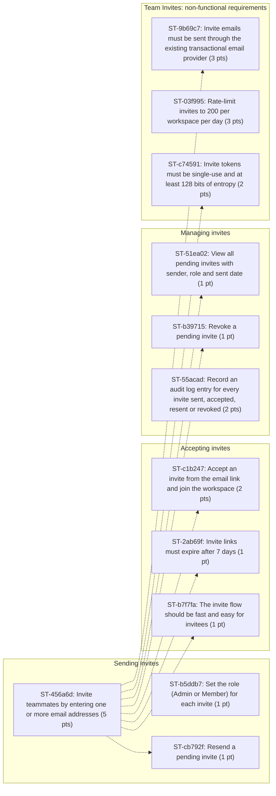

# Backlog: Team Invites

Generated by `heuristic` from `examples/team-invites.md`.

| Epics | Stories | Story points | Requirements | Dependencies | Risks |
| ---: | ---: | ---: | ---: | ---: | ---: |
| 4 | 12 | 23 | 12 | 8 | 3 |

## EP-2f525c: Sending invites

Requirements under "Team Invites > Requirements > Sending invites".

### ST-456a6d: Invite teammates by entering one or more email addresses

As a workspace admin, I want to invite teammates by entering one or more email addresses, so that it supports the goal "Let workspace owners add their team without contacting support".

- Priority: should | Estimate: 5 pts
- Estimate rationale: base 1; +2 for 3 acceptance criteria; +1 measurable performance target (within 2 minutes) = score 4 -> 5 pts
- Traces to REQ-456a6d (examples/team-invites.md:27): Workspace admins can invite teammates by entering one or more email addresses.
- Labels: benefit-inferred

Acceptance criteria:

- [ ] **Given** a workspace admin, **when** an admin submits up to 20 valid addresses, **then** each address receives an invite email within 2 minutes.
- [ ] **Given** a workspace admin, **when** an address is malformed, **then** the form shows an inline error and no invite is sent for it.
- [ ] **Given** a workspace admin, **when** the address already belongs to a member, **then** the admin sees "already a member".

### ST-b5ddb7: Set the role (Admin or Member) for each invite

As a workspace admin, I want to set the role (Admin or Member) for each invite, so that it supports the goal "Keep workspace membership auditable for security reviews".

- Priority: should | Estimate: 1 pt
- Estimate rationale: base 1 = score 1 -> 1 pt
- Traces to REQ-b5ddb7 (examples/team-invites.md:31): Workspace admins can set the role (Admin or Member) for each invite.
- Labels: benefit-inferred

Acceptance criteria:

- [ ] **Given** a role is selected, **when** the invite is accepted, **then** the new member has that role.

### ST-cb792f: Resend a pending invite

As a workspace admin, I want to resend a pending invite, so that it supports the goal "Keep workspace membership auditable for security reviews".

- Priority: should | Estimate: 1 pt
- Estimate rationale: base 1 = score 1 -> 1 pt
- Traces to REQ-cb792f (examples/team-invites.md:33): Workspace admins can resend a pending invite.
- Blocked by: ST-456a6d
- Labels: benefit-inferred

Acceptance criteria:

- [ ] **Given** a workspace admin, **when** the workspace admin resends a pending invite, **then** resending generates a new link and invalidates the previous one.

## EP-8bb632: Accepting invites

Requirements under "Team Invites > Requirements > Accepting invites".

### ST-c1b247: Accept an invite from the email link and join the workspace

As an invitee, I want to accept an invite from the email link and join the workspace, so that it supports the goal "Let workspace owners add their team without contacting support".

- Priority: should | Estimate: 2 pts
- Estimate rationale: base 1; +1 for 2 acceptance criteria = score 2 -> 2 pts
- Traces to REQ-c1b247 (examples/team-invites.md:38): Invitees can accept an invite from the email link and join the workspace.
- Blocked by: ST-456a6d
- Labels: benefit-inferred

Acceptance criteria:

- [ ] **Given** an invitee, **when** an invitee with an existing account opens a valid link, **then** they join the workspace after one confirmation click.
- [ ] **Given** an invitee, **when** an invitee without an account opens a valid link, **then** they are taken to sign-up with the email prefilled.

### ST-2ab69f: Invite links must expire after 7 days

As a workspace admin, I want invite links to expire after 7 days, so that it supports the goal "Let workspace owners add their team without contacting support".

- Priority: must | Estimate: 1 pt
- Estimate rationale: base 1 = score 1 -> 1 pt
- Traces to REQ-2ab69f (examples/team-invites.md:41): Invite links must expire after 7 days.
- Blocked by: ST-456a6d
- Labels: benefit-inferred

Acceptance criteria:

- [ ] **Given** a workspace admin, **when** an invitee opens an expired link, **then** they see an expiry message and a button to request a new invite.

### ST-b7f7fa: The invite flow should be fast and easy for invitees

As an invitee, I want the invite flow to be fast and easy for invitees, so that it supports the goal "Let workspace owners add their team without contacting support".

- Priority: should | Estimate: 1 pt
- Estimate rationale: base 1 = score 1 -> 1 pt
- Traces to REQ-b7f7fa (examples/team-invites.md:43): The invite flow should be fast and easy for invitees.
- Blocked by: ST-456a6d
- Labels: benefit-inferred

Acceptance criteria:

- [ ] **Given** an invitee, **when** the behaviour is exercised, **then** the invite flow should be fast and easy for invitees. _(inferred)_

## EP-2f8b9d: Managing invites

Requirements under "Team Invites > Requirements > Managing invites".

### ST-51ea02: View all pending invites with sender, role and sent date

As a workspace admin, I want to view all pending invites with sender, role and sent date, so that it supports the goal "Keep workspace membership auditable for security reviews".

- Priority: should | Estimate: 1 pt
- Estimate rationale: base 1 = score 1 -> 1 pt
- Traces to REQ-51ea02 (examples/team-invites.md:47): Workspace admins can view all pending invites with sender, role and sent date.
- Blocked by: ST-456a6d
- Labels: benefit-inferred

Acceptance criteria:

- [ ] **Given** a workspace admin, **when** the workspace admin views all pending invites with sender, role and sent date, **then** workspace admins can view all pending invites with sender, role and sent date. _(inferred)_

### ST-b39715: Revoke a pending invite

As a workspace admin, I want to revoke a pending invite, so that it supports the goal "Keep workspace membership auditable for security reviews".

- Priority: should | Estimate: 1 pt
- Estimate rationale: base 1 = score 1 -> 1 pt
- Traces to REQ-b39715 (examples/team-invites.md:48): Workspace admins can revoke a pending invite.
- Blocked by: ST-456a6d
- Labels: benefit-inferred

Acceptance criteria:

- [ ] **Given** a workspace admin, **when** an admin revokes an invite, **then** its link stops working immediately.

### ST-55acad: Record an audit log entry for every invite sent, accepted, resent or revoked

As a workspace admin, I want the system to record an audit log entry for every invite sent, accepted, resent or revoked, so that it supports the goal "Let workspace owners add their team without contacting support".

- Priority: must | Estimate: 2 pts
- Estimate rationale: base 1; +1 security or compliance (audit) = score 2 -> 2 pts
- Traces to REQ-55acad (examples/team-invites.md:50): The system must record an audit log entry for every invite sent, accepted, resent or revoked.
- Labels: benefit-inferred

Acceptance criteria:

- [ ] **Given** a workspace admin, **when** the system records an audit log entry for every invite sent, accepted, resent or revoked, **then** each entry includes actor, target email, action and timestamp in UTC.

## EP-ea441d: Team Invites: non-functional requirements

Requirements under "Team Invites > Non-functional requirements".

### ST-9b69c7: Invite emails must be sent through the existing transactional email provider

As a workspace admin, I want invite emails to be sent through the existing transactional email provider, so that it supports the goal "Let workspace owners add their team without contacting support".

- Priority: must | Estimate: 3 pts
- Estimate rationale: base 1; +2 external integration (email provider) = score 3 -> 3 pts
- Traces to REQ-9b69c7 (examples/team-invites.md:55): Invite emails must be sent through the existing transactional email provider.
- Blocked by: ST-456a6d
- Labels: non-functional, benefit-inferred

Acceptance criteria:

- [ ] **Given** a workspace admin, **when** the behaviour is exercised, **then** invite emails must be sent through the existing transactional email provider. _(inferred)_

### ST-03f995: Rate-limit invites to 200 per workspace per day

As a workspace admin, I want the system to rate-limit invites to 200 per workspace per day, so that it supports the goal "Reduce time from workspace creation to first collaborator joining to under 1 day".

- Priority: must | Estimate: 3 pts
- Estimate rationale: base 1; +2 distributed-state complexity (rate-limit) = score 3 -> 3 pts
- Traces to REQ-03f995 (examples/team-invites.md:56): The system must rate-limit invites to 200 per workspace per day.
- Labels: non-functional, benefit-inferred

Acceptance criteria:

- [ ] **Given** a workspace admin, **when** the system rate-limits invites to 200 per workspace per day, **then** the system must rate-limit invites to 200 per workspace per day. _(inferred)_

### ST-c74591: Invite tokens must be single-use and at least 128 bits of entropy

As a workspace admin, I want invite tokens to be single-use and at least 128 bits of entropy, so that it supports the goal "Let workspace owners add their team without contacting support".

- Priority: must | Estimate: 2 pts
- Estimate rationale: base 1; +1 security or compliance (tokens, entropy) = score 2 -> 2 pts
- Traces to REQ-c74591 (examples/team-invites.md:57): Invite tokens must be single-use and at least 128 bits of entropy.
- Blocked by: ST-456a6d
- Labels: non-functional, benefit-inferred

Acceptance criteria:

- [ ] **Given** a workspace admin, **when** the behaviour is exercised, **then** invite tokens must be single-use and at least 128 bits of entropy. _(inferred)_

## Dependencies

Solid arrows are stated in the PRD; dotted arrows were inferred.

## Risks

| ID | Risk | Likelihood | Impact | Mitigation | Related |
| --- | --- | --- | --- | --- | --- |
| RISK-38ad73 | Invite emails may land in spam folders, lowering acceptance rate. | medium | medium | Not stated in PRD | ST-c1b247, ST-456a6d, ST-9b69c7 |
| RISK-e2b1e7 | Rate limits that are too strict could block legitimate onboarding for large teams. | medium | medium | Not stated in PRD |  |
| RISK-ef2de2 | Unresolved question: Should Members (not only Admins) be allowed to send invites? | medium | medium | Resolve with the PRD owner before the related stories enter a sprint. | ST-b5ddb7 |

## Out of scope (from the PRD)

- Inviting users via SCIM or directory sync. (line 61)
- Bulk CSV upload of invitees. (line 62)
- Custom invite email branding. (line 63)
