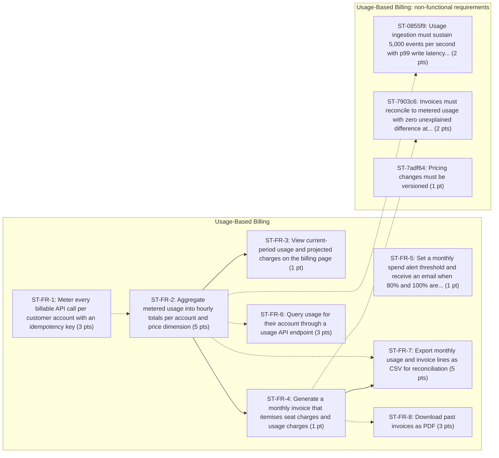

# Backlog: Usage-Based Billing

Generated by `heuristic` from `examples/usage-based-billing.md`.

| Epics | Stories | Story points | Requirements | Dependencies | Risks |
| ---: | ---: | ---: | ---: | ---: | ---: |
| 2 | 11 | 27 | 11 | 9 | 4 |

## EP-0e7c4c: Usage-Based Billing

We currently bill a flat monthly price per seat. Customers running large API workloads pay the same as light users, and finance cannot price heavy usage. This PRD introduces metered billing for API calls on top of the seat price.

### ST-FR-1: Meter every billable API call per customer account with an idempotency key

As a billing admin, I want the system to meter every billable API call per customer account with an idempotency key, so that it supports the goal "Charge customers in proportion to API usage".

- Priority: must | Estimate: 3 pts
- Estimate rationale: base 1; +2 distributed-state complexity (idempotency) = score 3 -> 3 pts
- Traces to FR-1 (examples/usage-based-billing.md:33): The system must meter every billable API call per customer account with an idempotency key.
- Labels: benefit-inferred

Acceptance criteria:

- [ ] **Given** a billing admin, **when** the same idempotency key is received twice, **then** usage is counted once.

### ST-FR-2: Aggregate metered usage into hourly totals per account and price dimension

As a billing admin, I want the system to aggregate metered usage into hourly totals per account and price dimension, so that it supports the goal "Close the monthly books without manual usage reconciliation".

- Priority: must | Estimate: 5 pts
- Estimate rationale: base 1; +2 distributed-state complexity (aggregate); +1 measurable performance target (within 15 minutes) = score 4 -> 5 pts
- Traces to FR-2 (examples/usage-based-billing.md:34): The system must aggregate metered usage into hourly totals per account and price dimension.
- Blocked by: ST-FR-1
- Labels: benefit-inferred

Acceptance criteria:

- [ ] **Given** a billing admin, **when** an hour closes, **then** its totals are final within 15 minutes.

### ST-FR-3: View current-period usage and projected charges on the billing page

As a billing admin, I want to view current-period usage and projected charges on the billing page, so that it supports the goal "Charge customers in proportion to API usage".

- Priority: must | Estimate: 1 pt
- Estimate rationale: base 1 = score 1 -> 1 pt
- Traces to FR-3 (examples/usage-based-billing.md:35): Billing admins can view current-period usage and projected charges on the billing page. Depends on FR-2.
- Blocked by: ST-FR-2
- Labels: benefit-inferred

Acceptance criteria:

- [ ] **Given** a billing admin, **when** the billing admin views current-period usage and projected charges on the billing page, **then** projected charges use the trailing 7-day average and are labelled as an estimate.

### ST-FR-4: Generate a monthly invoice that itemises seat charges and usage charges

As a billing admin, I want the system to generate a monthly invoice that itemises seat charges and usage charges, so that it supports the goal "Charge customers in proportion to API usage".

- Priority: must | Estimate: 1 pt
- Estimate rationale: base 1 = score 1 -> 1 pt
- Traces to FR-4 (examples/usage-based-billing.md:36): The system must generate a monthly invoice that itemises seat charges and usage charges. Depends on FR-2.
- Blocked by: ST-FR-2
- Labels: benefit-inferred

Acceptance criteria:

- [ ] **Given** a billing admin, **when** the system generates a monthly invoice that itemises seat charges and usage charges, **then** the system must generate a monthly invoice that itemises seat charges and usage charges. _(inferred)_

### ST-FR-5: Set a monthly spend alert threshold and receive an email when 80% and 100% are...

As a billing admin, I want to set a monthly spend alert threshold and receive an email when 80% and 100% are reached, so that it supports the goal "Close the monthly books without manual usage reconciliation".

- Priority: should | Estimate: 1 pt
- Estimate rationale: base 1 = score 1 -> 1 pt
- Traces to FR-5 (examples/usage-based-billing.md:37): Billing admins can set a monthly spend alert threshold and receive an email when 80% and 100% are reached.
- Labels: benefit-inferred

Acceptance criteria:

- [ ] **Given** a billing admin, **when** usage crosses a threshold, **then** exactly one alert email is sent per threshold per period.

### ST-FR-6: Query usage for their account through a usage API endpoint

As a developer, I want to query usage for their account through a usage API endpoint, so that it supports the goal "Charge customers in proportion to API usage".

- Priority: should | Estimate: 3 pts
- Estimate rationale: base 1; +2 external integration (api endpoint) = score 3 -> 3 pts
- Traces to FR-6 (examples/usage-based-billing.md:38): Developers can query usage for their account through a usage API endpoint.
- Blocked by: ST-FR-2
- Labels: benefit-inferred

Acceptance criteria:

- [ ] **Given** a developer, **when** the developer queries usage for their account through a usage API endpoint, **then** developers can query usage for their account through a usage API endpoint. _(inferred)_

### ST-FR-7: Export monthly usage and invoice lines as CSV for reconciliation

As a finance analyst, I want to export monthly usage and invoice lines as CSV for reconciliation, so that it supports the goal "Close the monthly books without manual usage reconciliation".

- Priority: should | Estimate: 5 pts
- Estimate rationale: base 1; +2 external integration (csv); +1 security or compliance (reconciliation) = score 4 -> 5 pts
- Traces to FR-7 (examples/usage-based-billing.md:39): Finance analysts can export monthly usage and invoice lines as CSV for reconciliation. Depends on FR-4.
- Blocked by: ST-FR-4, ST-FR-2
- Labels: benefit-inferred

Acceptance criteria:

- [ ] **Given** a finance analyst, **when** the finance analyst exports monthly usage and invoice lines as CSV for reconciliation, **then** finance analysts can export monthly usage and invoice lines as CSV for reconciliation. _(inferred)_

### ST-FR-8: Download past invoices as PDF

As a billing admin, I want to download past invoices as PDF, so that it supports the goal "Give customers a clear, near-real-time view of what they will be billed".

- Priority: could | Estimate: 3 pts
- Estimate rationale: base 1; +2 external integration (pdf) = score 3 -> 3 pts
- Traces to FR-8 (examples/usage-based-billing.md:40): Billing admins can download past invoices as PDF.
- Blocked by: ST-FR-4
- Labels: benefit-inferred

Acceptance criteria:

- [ ] **Given** a billing admin, **when** the billing admin downloads past invoices as PDF, **then** billing admins can download past invoices as PDF. _(inferred)_

## EP-83bd65: Usage-Based Billing: non-functional requirements

Requirements under "Usage-Based Billing > Non-functional requirements".

### ST-0855f9: Usage ingestion must sustain 5,000 events per second with p99 write latency...

As a billing admin, I want usage ingestion to sustain 5,000 events per second with p99 write latency under 50 ms, so that it supports the goal "Charge customers in proportion to API usage".

- Priority: must | Estimate: 2 pts
- Estimate rationale: base 1; +1 measurable performance target (5,000 events, per second, p99) = score 2 -> 2 pts
- Traces to REQ-0855f9 (examples/usage-based-billing.md:51): Usage ingestion must sustain 5,000 events per second with p99 write latency under 50 ms.
- Blocked by: ST-FR-2
- Labels: non-functional, benefit-inferred

Acceptance criteria:

- [ ] **Given** a billing admin, **when** the behaviour is exercised, **then** usage ingestion must sustain 5,000 events per second with p99 write latency under 50 ms. _(inferred)_

### ST-7903c6: Invoices must reconcile to metered usage with zero unexplained difference at...

As a billing admin, I want invoices to reconcile to metered usage with zero unexplained difference at month close, so that it supports the goal "Close the monthly books without manual usage reconciliation".

- Priority: must | Estimate: 2 pts
- Estimate rationale: base 1; +1 security or compliance (reconcile) = score 2 -> 2 pts
- Traces to REQ-7903c6 (examples/usage-based-billing.md:52): Invoices must reconcile to metered usage with zero unexplained difference at month close.
- Blocked by: ST-FR-4
- Labels: non-functional, benefit-inferred

Acceptance criteria:

- [ ] **Given** a billing admin, **when** the behaviour is exercised, **then** invoices must reconcile to metered usage with zero unexplained difference at month close. _(inferred)_

### ST-7adf64: Pricing changes must be versioned

As a billing admin, I want pricing changes to be versioned, so that past invoices can be regenerated exactly.

- Priority: must | Estimate: 1 pt
- Estimate rationale: base 1 = score 1 -> 1 pt
- Traces to REQ-7adf64 (examples/usage-based-billing.md:53): Pricing changes must be versioned so past invoices can be regenerated exactly.
- Labels: non-functional

Acceptance criteria:

- [ ] **Given** a billing admin, **when** the behaviour is exercised, **then** pricing changes must be versioned so past invoices can be regenerated exactly. _(inferred)_

## Dependencies

Solid arrows are stated in the PRD; dotted arrows were inferred.

## Risks

| ID | Risk | Likelihood | Impact | Mitigation | Related |
| --- | --- | --- | --- | --- | --- |
| RISK-5ee2dd | Metering bugs directly cause over- or under-billing and erode customer trust. | medium | high | Not stated in PRD | ST-FR-1 |
| RISK-c891e5 | Customers may react badly to bill increases without warning. | medium | medium | Not stated in PRD | ST-FR-3, ST-FR-8 |
| RISK-9c1c88 | Unresolved question: Do we offer a free usage tier per plan, and how large? | medium | medium | Resolve with the PRD owner before the related stories enter a sprint. |  |
| RISK-8d81e6 | External dependency: The payments provider integration must support adding usage line items to invoices. | medium | high | Confirm scope and timeline with the owning team before committing dependents. | ST-FR-4, ST-FR-7, ST-7903c6 |

## Out of scope (from the PRD)

- Prepaid credits and committed-use discounts. (line 57)
- Multi-currency invoicing. (line 58)
- Tax calculation changes. (line 59)
